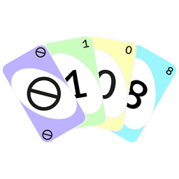

# 108.cards
An open-source, simple variation of the basic UNO game gone pastel.

 

# Requirements
- node.js 16+
- npm 6+
- go 1.20+

 

# Structure
The <b>frontend</b> consists of a simple [React](https://reactjs.org) app with [TypeScript](https://www.typescriptlang.org) in the root of the repository which can be served locally for development by simply running `npm ci` and `npm run start`.  
The <b>backend</b> located in [/server](server) is based on [PocketBase](https://pocketbase.io) which is extended via native [Go](https://golang.org) code and can be compiled as a single batteries included executable by running `go mod download` and `go build main`.
